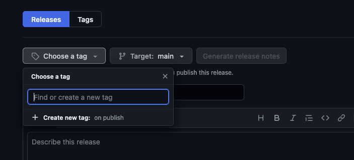
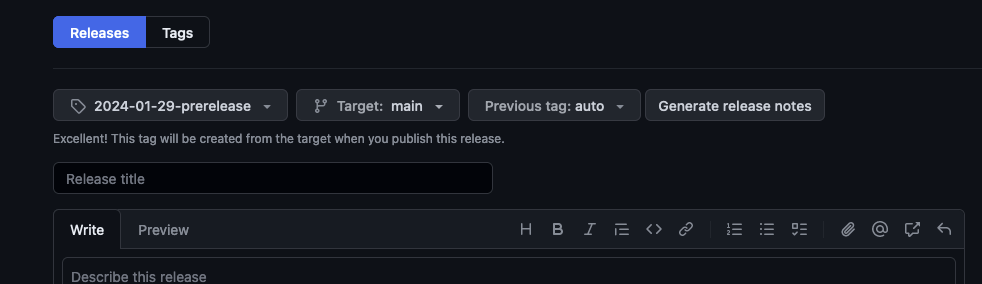
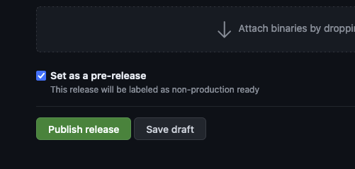

# Deployment

This application is deployed to WordPress VIP which uses branch-based deployments. However, the GoodBids organization uses tagged releases.

For this document, we will assume that you are in the GoodBids organization. All references to the VIP repo will be prefixed with `vip:`.

## Deployment Process

We have three environments:

-   develop: unstable development branch
-   staging: stable QA and UAT branch
-   production: stable production branch

We will cover how to deploy to each of these environments.

### Develop

Merges into `main` are automatically shipped to `vip:develop` after Github Workflows successfully complete.

### Staging

To deploy to staging, you must create a _prerelease_ in the [goodbids repo](https://github.com/Good-Bids/goodbids/releases).

Create a new tag with the format `YYYY-MM-DD`. For example, `2024-01-29`. If you have multiple prereleases in a day, append a number to the end. For example, `2024-01-29-1`.

Target `main` as the target branch, select the previous tag (if necessary, auto will usually be correct), and generate release notes.

Finally, set as a prerelease and publish.

### Production

Ideally, we are always upgrading prereleases to releases when deploying to production. This ensures that the code we are shipping to production is the same code that has been tested in staging.

To upgrade a prelease to a release, edit the release and uncheck the prerelease checkbox. You will also want to ensure that `Set as latest release` is checked.

### Non Standard Deployments

In general, we should always follow the process outlined above. Create a prerelease and test it in staging. If it passes, upgrade it to a release and deploy to production. If it fails, make changes and create a new prerelease.

However, there might be instances where we want to directly ship code to production such as hotfixes or emergency changes.

In these cases, you have two options:

1. A developer can directly push their branch to production using `git push vip <branch-name>:production`. This change will need to be merged back into `main` before the next production release or it will be overridden.
2. You can follow the same steps for creating a staging deployment, but create a release instead of a prerelease.

Option 1 can be used for any environment, but requires the developer have access to the VIP repo and be set up to push to it.

Option 2 only works for production, but creates a better paper trail and ensures that code is already merged into `main` for the next release.

## Deployment Pipeline

Dependencies need to be installed before the application can be deployed. This is handled by [CircleCI](https://circleci.com/github-login/) in the VIP repo.

This pipeline runs whenever a commit is pushed to the `develop`, `staging`, or `production` branches. The pipeline will install dependencies, build the application, and push those changes to the appropriate `-built` branches in the VIP repo.

The full pipeline looks like this:

1. Changes merged into `main`
2. `main` is pushed to `vip:develop`
3. `vip:develop` is built in Circle CI and pushed to `vip:develop-built`
4. `vip:develop-built` is deployed to the develop environment

## Syncing Releases

Typically, we should try to keep releases synced between the GoodBids Node repo and this one.

Since these two releases _will not_ deploy at the exact same time, breaking changes should be released during low traffic times.

[You can view the Node release docs here.](https://github.com/Good-Bids/goodbids-node/blob/main/docs/deployment.md)
